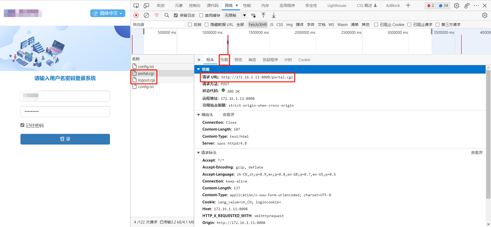

# 互联网认证系统

## 引言

基于 Python 实现一键登录和注销。（采用日志记录解决因无法获取密钥而不能立刻注销的问题）

## 安装

```bash
pip install -r requirements.txt
```

## 用法

- 登录

```bash
python auth.py login
```

- 注销

```bash
python auth.py logout
```

## 思路

1. 首先在登录和注销的时候打开浏览器**开发者工具**，选择**网络**，勾选**保留日志**



2. 这样就能获取登录接口和注销接口，以及调用接口所需要的表单数据（在负载中查看）


3. 可以看到用户名和密码都被加密了，加密算法是 aes，具体的加密代码在 js 中写的有


4. 我们这里是基于 python 做的，所以需要将上述加密代码改为 python 实现

> 具体代码实现见：[rsa_security.py](/rsa_security.py)

5. 测试了一下可以正常登录，说明加密算法有效，然后编写网络认证脚本实现登录和注销

> 具体代码实现见：[auth.py](/auth.py)

## 参考

- [前端加密 JS 库--CryptoJS 使用指南](http://t.zoukankan.com/tommymarc-p-13187435.html)
- [python 实现 AES 加密解密](https://blog.csdn.net/chouzhou9701/article/details/122019967)
- [python 实现 AES 加密](https://blog.csdn.net/dhdichch/article/details/125005715)
